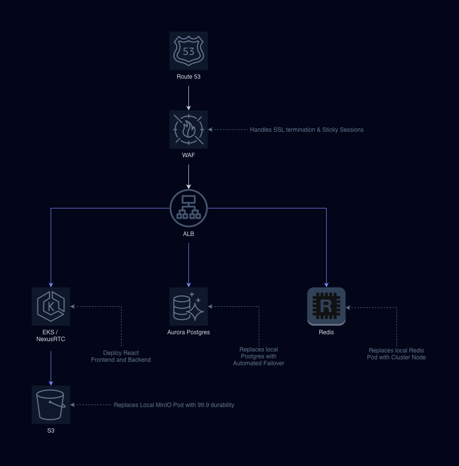

## Architectural Engineering Overview
The platform utilizes a decoupled, unified client-server architecture designed to scale seamlessly from a single-node containerized environment to a distributed cloud orchestration topology.


### Core Networking & Request Path Lifecycle
*   **Unified Path Prioritization**: The `k8s/ingress.yml` layout orders rules from longest prefix to shortest (`/api`, `/ws`, and then `/`) to eliminate prefix matching bypasses.
*   **First-Party Session Affinity Anchor**: By routing all stateless React assets, high-throughput JSON REST interfaces, and full-duplex WebSocket connections under a single master domain string (`nexus-rtc.localhost`), NGINX drops cookie tracking blocks natively. NGINX issues a single `NEXUS_RTC_AFFINITY` cookie that forces both browser REST operations and active STOMP clients to lock securely onto identical backend pod replicas, preserving room session integrity.

---

## Distributed Signaling & Cross-Pod Synchronization Matrix (Phase 1 Baseline)
When backend instances scale horizontally (`replicas: 3`), user sessions are divided across separate pod spaces. To bridge these isolated memory stacks without forcing stateful dependencies on individual pods, the platform implements an asynchronous Redis Pub/Sub cluster backbone.

### Path A: Global Redis Broadcast & Dynamic Room Fanout (Active)
1. **Handshake Lifecycle Validation**: `@stomp/stompjs` boots. Custom inbound channel interceptors parse incoming `Bearer JWT` headers inside connection packets, upgrading anonymous connections to securely mapped, stateful application `Principal` entities.
2. **Atomic Channel Entry**: When a user types a message or joins a room, the frontend fires a single STOMP frame to `/app/chat.sendMessage/{channelId}`. The backend intercepts the payload, writes data records to PostgreSQL, and calls `redisTemplate.convertAndSend("app:channel:" + channelId, chatMessage)`.
3. **Cluster Backplane Propagation**: The shared Redis engine processes the packet. Because the cluster’s `RedisMessageListenerContainer` monitors a global pattern wildcard (`app:channel:*`), every active replica pod captures the event.
4. **Targeted Local Socket Ingestion**: The background `RedisMessageSubscriber.java` listener class intercepts the cross-node cluster event. It unpacks the payload JSON parameters, extracts the target `channelId`, and dynamically routes the frame locally by executing `messagingTemplate.convertAndSend("/topic/channels/" + channelId, jsonNode)`, completely neutralizing horizontal socket isolation blackouts.
5. **WebRTC Media Coordination**: WebRTC calling signaling handshakes follow the exact same cross-pod flow. Offers, Answers, and Candidates publish via `redisTemplate` to the global `nexus-rtc-signaling` channel. The subscriber intercepts the signal and drops it down to the universally subscribed `/topic/public` lane cluster-wide, where clients use text-handle matching to drop self-broadcast echoes and isolate peer connections.

---

## Future Optimization Roadmap: Pinned Path B Integration
While **Path A** ensures absolute cross-node stability, it requires every running replica pod to parse every single event frame, introducing an \(O(N)\) compute loop as user thresholds scale. To maximize compute efficiency, a targeted routing enhancement has been pinned for future implementation:

1. **Kubernetes Downward API Pod Extraction**: The backend deployment manifest will extract the node container identifier string directly into the core application context environment:
   ```yaml
   env:
     - name: K8S_POD_HOSTNAME
       valueFrom:
         fieldRef:
           fieldPath: metadata.name
   ```
2. **Distributed Global Session Directory**: Upon successful WebSocket connection frames, the server will cache the user's username mapped against their current `${K8S_POD_HOSTNAME}` inside a centralized Redis global map lookup dictionary (`HashOperations`).
3. **Surgical Notification Dispatches**: Out-of-channel user notification alerts will bypass wide pattern loops. The `NotificationController` will pull the recipient's exact hosting pod hostname directly from the Redis session directory, publishing the alert frame straight to a pod-isolated topic: `app-notifications:{K8S_POD_HOSTNAME}`. Only the single node actively hosting that user session will ingest the event, reducing unnecessary cluster-wide network overhead.

---

## Decoupled Storage Class & Data Architecture
To secure structural user accounts, text history timelines, and high-volume media files against zero-downtime cluster restarts, the system drops ephemeral standard allocations and configures permanent volumes.

*   **Database Immutability**: The system sets `hibernate.ddl-auto: validate` inside `application.yml`. Schema initialization is managed strictly via incremental, version-controlled **Flyway SQL migrations**, protecting database contents from accidental over-writes during rolling cluster updates.
*   **Secure Object Storage Facade**: File uploads completely bypass local container disk stores. The platform hands the multipart stream over to `StorageFacade.java`, which generates a cryptographically secure UUID key identifier and uploads the file directly to an isolated, public-read restricted S3-compatible **MinIO bucket**.
*   **Time-Bound Presigned Vectors**: To safeguard media attachments without making the S3 bucket public, fetching chat logs triggers the `StorageFacade` to generate a secure, temporary, 2-hour pre-signed access URL (`GetPresignedObjectUrlArgs`). This transient address is mapped straight onto a Lombok `@Transient` property field for secure JSON transport, ensuring absolute media privacy.

---

## Software Engineering Design Patterns Applied
*   **Strategy Pattern (Notification Routing Strategy)**: Deployed across the push alert system dashboard layers. The notification manager interface (`NotificationStrategy`) abstracts delivery actions, allowing the engine to seamlessly switch between full-duplex WebSocket pushes (`WebSocketNotificationStrategy`) or external fallbacks without altering core business controller blocks.
*   **Facade Pattern (Storage Architecture Interface)**: Implemented via the `StorageFacade.java` layer. It acts as a clean, high-utility unified wrapper abstraction layer covering the complex underlying Amazon S3 and MinIO SDK initialization parameters, error boundaries, and input streams.
*   **Observer Pattern (Distributed WebSocket Frame Brokers)**: Utilized natively throughout the STOMP message router network layer. Connected clients establish passive observation lines tracking localized paths (`/topic/channels/*`). The backend instances observe the shared Redis backbone, dynamically updating room state matrices upon incoming cluster event broadcasts.

---

## DevOps & Automated ARM64 Jenkins Pipeline Layout
The integration loop splits execution scopes across distinct, targeted runtime environments to establish portable, stateless security validation pipelines:

*   **Backend Validation Block**: Instantiates a bounded `maven:3.9-eclipse-temurin-17` workspace image to securely complete independent automated verification scripts and regression testing maps.
*   **Frontend Type Enforcement**: Concurrently provisions an independent `node:20` environment, triggering headless compilation sweeps (`tsc --noEmit`) to verify interface definitions without emitting code.
*   **Self-Contained ARM64 Container Image Scan**: To accommodate Apple Silicon or ARM64 host processor execution layers natively inside dynamic ephemeral worker agents, Stage 4 bypasses unstable `tar` tools or x86 architecture mismatches. It uses native `dpkg` to register the official ARM64 binary archive package directly inside the active pipeline container workspace on-the-fly:
    ```groovy
    sh 'curl -fsSL "https://github.com/aquasecurity/trivy/releases/download/v0.72.0/trivy_0.72.0_Linux-ARM64.deb" -o trivy.deb'
    sh 'dpkg -i trivy.deb'
    sh 'rm trivy.deb'
    ```

---

## Technical Setup & Local Execution (Local Testing): Two Options. Choose one.

### Option 1: Docker Compose
#### Prerequisites
* Docker Desktop installed
* Mac local `/etc/hosts` modified to route `127.0.0.1 minio.localhost` and `127.0.0.1 nexus-rtc.localhost`

#### Step 1: Provision Configuration Files
Provide your security profile parameters and keys inside `backend/src/main/resources/application.yml`.

#### Step 2: Spin Up the Infrastructure Environment
Execute the deployment run command from the root configuration path:
```bash
docker-compose up --build -d
```
This single invocation builds and launches:
1. PostgreSQL Engine at `localhost:5432`
2. Spring Boot Service Application at `localhost:8080`
3. Nginx Served Frontend Client Production Layer at `localhost:80`
4. Coturn NAT Gateway Routing Subsystem at `localhost:3478`

#### Step 3: Run Verification Test Suites
Verify integration status bounds locally:
```bash
cd backend && mvn test
cd frontend && npm install && npm run build
```

### Option 2: Kubernetes
#### Prerequisites
* Docker Desktop installed
* MiniKube installed
* kubectl installed
* Mac local `/etc/hosts` modified to route `nexus-rtc.localhost app.nexus-rtc.localhost service.nexus-rtc.localhost storage-ui.nexus-rtc.localhost storage.nexus-rtc.localhost jenkins.localhost` to `127.0.0.1`

#### Step 1: Ensure Minikube is ready
```shell
minikube start # start minikube
minikube tunnel # start minikube tunnel
```

#### Step 2: Build the Backend and Frontend images then load them into MiniKube
```shell
docker build --no-cache -t rtc-backend:latest ./backend
docker build --no-cache -t rtc-frontend:latest ./frontend

minikube image load rtc-backend:latest
minikube image load rtc-frontend:latest
```

#### Step 3: Deploy cluster to MiniKube
```shell
kubectl apply -f k8s
```

This builds and launches:
1. Jenkins UI at `jenkins.localhost`
2. Backend Spring Boot Application at `nexus-rtc.localhost/api` and `nexus-rtc.localhost/ws`
3. Nginx Served Frontend Client Production Layer at `nexus-rtc.localhost`
4. MinIO Admin/Storage UI Console at `storage-ui.nexus-rtc.localhost`
5. MinIO service endpoint at `storage.nexus-rtc.localhost`

## Advanced Production AWS Migration Roadmap
To transition this high-performance local Minikube toolchain into an enterprise-grade, highly available global AWS cloud topology, the following multi-region infrastructure blueprint is established:



1. **Amazon EKS (Elastic Kubernetes Service) Conversion**: Existing K8s deployment manifests map straight to EKS. Swap out the basic static Ingress for the AWS Load Balancer Controller, which automatically provisions a native Application Load Balancer (ALB). The ALB reads the annotations, terminates SSL certificates via AWS Certificate Manager (ACM), and natively enforces sticky routing cookies across all target availability groups.

2. **Stateless Storage & Database Promotion (RDS Aurora & S3)**: 
- Amazon Aurora PostgreSQL Serverless v2: Delete the local postgres-deployment.yml and point SPRING_DATASOURCE_URL straight to an Aurora cluster configured with automated Multi-AZ data replication and failover guards. 
- Amazon S3 Bucket: Completely delete minio-deployment.yml and update your StorageFacade.java configurations to target a secured Amazon S3 Bucket. This gives your file attachments immediate 119s of durability, automatic life-cycle archiving, and edge-cached content delivery streams without consuming cluster pod resources.

3. **Enterprise Redis Serverless Backbone (Amazon ElastiCache)**: Point the backend properties directly to an Amazon ElastiCache for Redis Cluster running in Cluster Mode enabled. This guarantees the cross-node messaging channels, WebRTC signaling streams, and user push notifications maintain sub-millisecond propagation latency worldwide, even if a primary region encounters a structural system drop.

